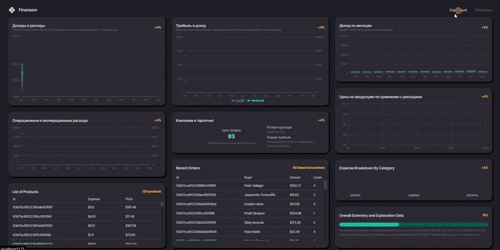
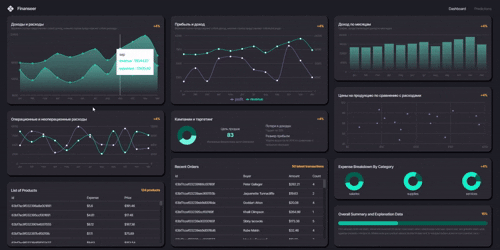
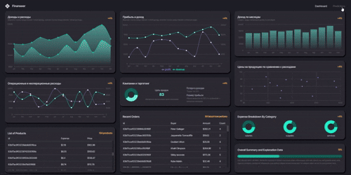

<h1 align="center">💰 Finance App</h1>

<p align="center">
  <b>Full-stack dashboard для анализа финансовых данных</b>
</p>

<p align="center">
 <table align="center">
<tr>
<td align="center" width="120">
<br>
<b>React 19</b>
</td>

<td align="center" width="120">
<br>
<b>TypeScript</b>
</td>

<td align="center" width="120">
<br>
<b>MongoDB</b>
</td>
</tr>

<td align="center" width="120">
<br>
<b>Node JS</b>
</td>
<td align="center" width="120">
<br>
</td>
</tr>
</table>
</p>
---

## 📌 О проекте

**Finance App** — учебный full-stack проект для анализа финансовых данных компании.

Приложение отображает финансовый dashboard, который позволяет работать с:

- 💵 общим доходом и расходами;
- 📈 прибылью;
- 📊 расходами по категориям;
- 📅 ежемесячной и ежедневной динамикой;
- 📦 списком продуктов;
- 💳 транзакциями.

Главная цель проекта — не просто создать интерфейс, а реализовать полноценную цепочку взаимодействия:

**React → RTK Query → REST API → Express → MongoDB**

Проект помог мне на практике разобраться с построением клиент-серверной архитектуры, организацией REST API и управлением серверными данными через Redux Toolkit и RTK Query.

---

# 📑 Содержание

- [🎥 Демонстрация](#-демонстрация)
- [🏗️ Архитектура](#️-архитектура)
- [🔄 Поток данных](#-поток-данных)
- [🛠️ Технологический стек](#️-технологический-стек)
- [⚛️ Frontend](#️-frontend)
- [🔌 Backend](#-backend)
- [🔄 Работа с RTK Query](#-работа-с-rtk-query)
- [🗃️ Redux Toolkit](#️-redux-toolkit)
- [🌐 REST API](#-rest-api)
- [📁 Структура проекта](#-структура-проекта)
- [🚀 Запуск проекта](#-запуск-проекта)
- [🧠 Что было реализовано](#-что-было-реализовано)
- [🔮 Возможные улучшения](#-возможные-улучшения)
- [🏁 Итог](#-итог)

---

# 🎥 Демонстрация

<!--
GIF-файлы находятся в:
assets/readme/

Замени названия файлов ниже на реальные названия своих GIF.
-->

<table>
<tr>
<td width="33%" align="center">



</td>

<td width="33%" align="center">



</td>

<td width="33%" align="center">



</td>
</tr>
</table>

<p align="center">
  <i>Демонстрация основных возможностей приложения</i>
</p>

---

# 🏗️ Архитектура

Проект разделён на две основные части: **Frontend** и **Backend**.

```text
                         ┌─────────────────────┐
                         │       React UI      │
                         │      Dashboard      │
                         └──────────┬──────────┘
                                    │
                                    ▼
                         ┌─────────────────────┐
                         │   Redux Toolkit     │
                         │     + RTK Query     │
                         └──────────┬──────────┘
                                    │
                              HTTP / REST
                                    │
                                    ▼
                         ┌─────────────────────┐
                         │   Node.js + Express │
                         │      REST API       │
                         └──────────┬──────────┘
                                    │
                                    ▼
                         ┌─────────────────────┐
                         │ MongoDB + Mongoose  │
                         │      Database       │
                         └─────────────────────┘
```

### Основные компоненты

- **React** — пользовательский интерфейс и компоненты приложения.
- **Redux Toolkit** — управление глобальным состоянием.
- **RTK Query** — получение, кэширование и обновление серверных данных.
- **Express** — создание REST API.
- **Node.js** — серверная среда выполнения.
- **MongoDB** — хранение финансовых данных.
- **Mongoose** — работа с MongoDB и моделями данных.

---

# 🔄 Поток данных
Основной сценарий получения данных выглядит следующим образом:

```
┌──────────────┐
│    User      │
└──────┬───────┘
       │
       ▼
┌──────────────┐
│  React UI    │
└──────┬───────┘
       │
       │ useGet...Query()
       ▼
┌──────────────┐
│  RTK Query   │
└──────┬───────┘
       │
       │ HTTP Request
       ▼
┌──────────────┐
│   Express    │
│   REST API   │
└──────┬───────┘
       │
       │ Mongoose
       ▼
┌──────────────┐
│   MongoDB    │
└──────┬───────┘
       │
       │ Response
       ▼
┌──────────────┐
│  RTK Query   │
│    Cache     │
└──────┬───────┘
       │
       ▼
┌──────────────┐
│   React UI   │
└──────────────┘
```
Таким образом, компоненты React не работают с базой данных напрямую.

Frontend взаимодействует с сервером через API, а RTK Query отвечает за управление состоянием серверных данных.

---

# 🛠️ Технологический стек

---

# ⚛️ Frontend
Frontend построен на React + TypeScript.

Основные задачи клиентской части:

- отображение финансовой статистики;
- работа с dashboard;
- отображение продуктов;
- отображение транзакций;
- фильтрация данных;
- работа с API;
- управление состоянием приложения;
- отображение состояний загрузки и ошибок.
Компоненты разделены по функциональному назначению, что позволяет переиспользовать UI и не смешивать бизнес-логику с отображением.

---

# 🔄 Работа с RTK Query
**RTK Query** используется в проекте для взаимодействия с backend API.

Основные задачи RTK Query:

- выполнение HTTP-запросов;
- управление состоянием загрузки;
- обработка ошибок;
- кэширование данных;
- повторное получение данных;
- автоматическое обновление UI после изменения данных.
Пример API-сервиса:

```
export const api = createApi({
  reducerPath: "api",
  baseQuery: fetchBaseQuery({
    baseUrl: BASE_URL,
  }),
  endpoints: (builder) => ({
    getProducts: builder.query({
      query: () => "/products",
    }),

    getTransactions: builder.query({
      query: () => "/transactions",
    }),
  }),
});
```
После создания API-сервиса необходимые hooks автоматически генерируются RTK Query:

```
const { data, isLoading, error } = useGetProductsQuery();
```
Компоненту React не требуется вручную управлять `fetch`, `loading` и `error`.

---

# 🗃️ Redux Toolkit
Redux Toolkit используется для управления глобальным состоянием приложения.

Вместо ручной настройки Redux используются современные инструменты:

- `configureStore`;
- `createSlice`;
- `createApi`;
- RTK Query middleware.
Пример slice:

```
const financeSlice = createSlice({
  name: "finance",

  initialState: {
    selectedCategory: "All",
    currentPage: 1,
  },

  reducers: {
    setCategory: (state, action) => {
      state.selectedCategory = action.payload;
    },

    setPage: (state, action) => {
      state.currentPage = action.payload;
    },
  },
});
```
Такой подход позволяет централизованно управлять состоянием приложения и автоматически обновлять компоненты при его изменении.

---

# 🌐 REST API
Backend предоставляет REST API, через который frontend получает необходимые данные.

Пример архитектуры endpoint'ов:

```
GET    /api/products
GET    /api/products/:id

GET    /api/transactions
GET    /api/transactions/:id

GET    /api/dashboard

POST   /api/products
POST   /api/transactions

PATCH  /api/products/:id
PATCH  /api/transactions/:id

DELETE /api/products/:id
DELETE /api/transactions/:id
```
Frontend не имеет прямого доступа к MongoDB.

Все запросы проходят через Express:

```
React
  ↓
RTK Query
  ↓
HTTP
  ↓
Express
  ↓
Controller
  ↓
Mongoose
  ↓
MongoDB
```
Такое разделение позволяет независимо развивать frontend и backend.

---

# 🗄️ Работа с MongoDB
Для хранения данных используется **MongoDB**.

Mongoose используется в качестве ODM для:

- создания схем;
- определения моделей;
- выполнения запросов;
- взаимодействия с коллекциями MongoDB.
Упрощённая структура данных:

```
MongoDB
│
├── products
│   ├── name
│   ├── price
│   ├── category
│   └── expense
│
├── transactions
│   ├── userId
│   ├── amount
│   ├── date
│   └── type
│
└── users
    ├── name
    ├── email
    └── role
```

---

# 📊 Dashboard
Dashboard является основной частью приложения.

На нём отображается сводная информация о финансовом состоянии:

- общий доход;
- общие расходы;
- прибыль;
- финансовая динамика;
- расходы по категориям;
- последние транзакции;
- информация о продуктах.
Данные для dashboard формируются backend'ом и передаются frontend через RTK Query.

---

# 📦 Products
Раздел Products предназначен для отображения информации о продуктах компании.

В интерфейсе можно работать с:

- названием продукта;
- стоимостью;
- категорией;
- финансовыми показателями;
- другими связанными данными.
Получение данных происходит через RTK Query.

---

# 💳 Transactions
Раздел Transactions отображает финансовые операции.

Для транзакций используются такие данные, как:

- сумма;
- дата;
- тип операции;
- пользователь;
- связанные финансовые показатели.
API отвечает за получение данных, а RTK Query управляет их состоянием на клиенте.

---

# 📁 Структура проекта
Общая структура проекта:

```
finance-app/
│
├── client/
│   ├── src/
│   │   ├── components/
│   │   ├── scenes/
│   │   ├── state/
│   │   │   ├── api.ts
│   │   │   └── index.ts
│   │   ├── App.tsx
│   │   └── main.tsx
│   │
│   ├── public/
│   └── package.json
│
├── server/
│   ├── controllers/
│   ├── models/
│   ├── routes/
│   ├── middleware/
│   ├── index.js
│   └── package.json
│
├── .gitignore
└── README.md
```

### Client
Отвечает за:

- UI;
- React-компоненты;
- Redux Toolkit;
- RTK Query;
- работу с API.

### Server
Отвечает за:

- REST API;
- бизнес-логику;
- MongoDB;
- Mongoose;
- обработку HTTP-запросов.

---

# 🚀 Запуск проекта

## 1. Клонирование репозитория

```
git clone https://github.com/bodicka/Finance-App.git

cd Finance-App
```

---

## 2. Установка зависимостей

### Frontend

```
cd client
npm install
```

### Backend

```
cd ../server
npm install
```

---

## 3. Настройка переменных окружения
Создайте `.env` в папке `server`:

```
MONGO_URI=your_mongodb_connection_string
PORT=5000
```

---

## 4. Запуск Backend

```
cd server
npm run dev
```

---

## 5. Запуск Frontend
В отдельном терминале:

```
cd client
npm run dev
```
После запуска откройте адрес, который будет указан Vite в терминале.

---

# 🧠 Что было реализовано
В рамках проекта были реализованы:

- полноценный React dashboard;
- клиент-серверная архитектура;
- REST API на Express;
- подключение MongoDB;
- модели данных через Mongoose;
- Redux Toolkit;
- RTK Query;
- кэширование серверных данных;
- обработка loading/error состояний;
- получение финансовой статистики;
- работа с продуктами;
- работа с транзакциями;
- фильтрация данных;
- пагинация;
- разделение frontend и backend;
- типизация frontend на TypeScript.

---

# 💡 Что было изучено
Основной фокус проекта — практическое применение **Redux Toolkit и RTK Query** в full-stack приложении.

В процессе разработки я разобрался с:

- организацией Redux Store;
- созданием Redux Slice;
- настройкой RTK Query;
- созданием API endpoints;
- автоматической генерацией React hooks;
- кэшированием запросов;
- состояниями `loading` и `error`;
- взаимодействием React с REST API;
- построением Express API;
- подключением MongoDB;
- работой с Mongoose;
- разделением клиентской и серверной части.

---

# 🔮 Возможные улучшения
В дальнейшем проект можно расширить следующими возможностями:

- 🔐 полноценная авторизация пользователей;
- 👥 разные роли пользователей;
- ➕ создание и редактирование транзакций;
- 🗑️ удаление финансовых операций;
- 🔍 расширенная фильтрация;
- 📅 выбор периода для финансовой статистики;
- 📈 дополнительные графики и аналитика;
- 📊 более подробная статистика по категориям;
- 🌙 Dark / Light Theme;
- 📱 полноценная адаптация под мобильные устройства;
- 🔔 уведомления об изменении финансовых показателей;
- ⚡ оптимизация API и кэширования;
- 🧪 добавление unit и integration tests.

---

# 🏁 Итог
**Finance App** — проект, в котором я на практике реализовал полноценное взаимодействие frontend и backend частей приложения.

Главный технический фокус проекта:

```
React
   ↓
Redux Toolkit
   ↓
RTK Query
   ↓
REST API
   ↓
Express
   ↓
Mongoose
   ↓
MongoDB
```
Проект позволил мне глубже разобраться в работе с серверными данными на frontend, построении REST API и организации full-stack архитектуры.

Особенно важной частью стала работа с **RTK Query**, поскольку именно она отвечает за взаимодействие клиентской части с API, кэширование и управление состояниями запросов.

---

# 📬 Контакты
